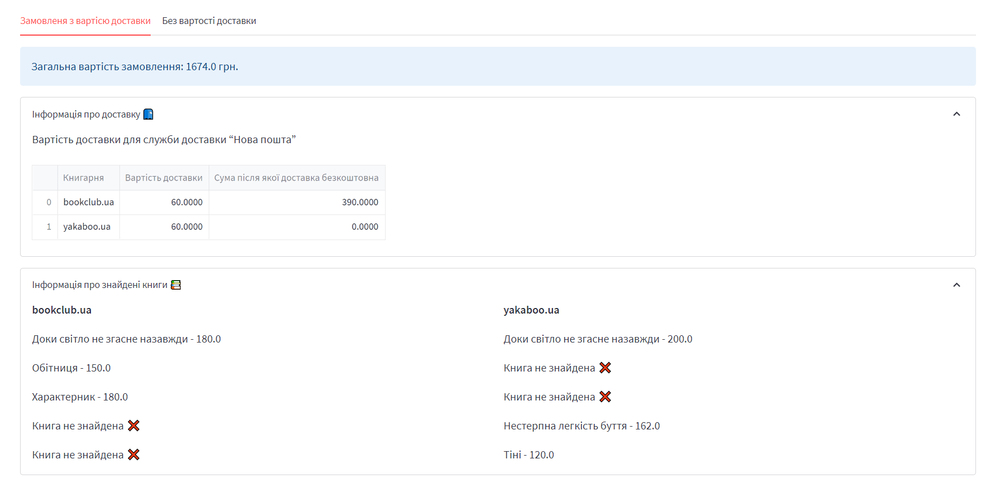
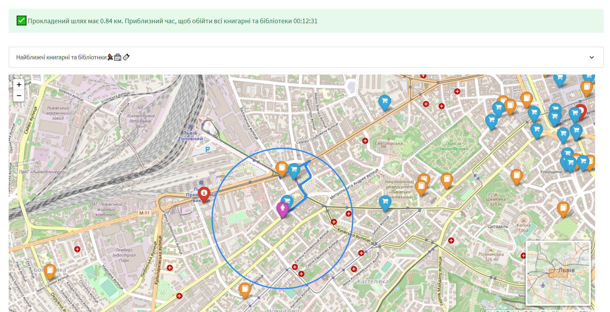
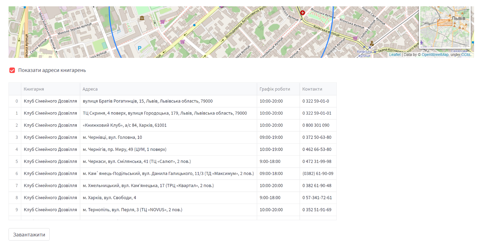

# BookFinder-Streamlit-Folium
This is an web-application that uses web-scraping as a tool for collecting information about online bookstore services and further analysis of this information to form the best-priced order . Additionally, data visualization is present to display libraries and bookstores near a given location. As well as route planning, identification of the nearest bookstores and libraries.
#### To install relevant packages
Open your shell or terminal and install the relevant packages using the command below

```python
pip install -r requirements.txt
```

#### To run this Application
Open the root folder of the project and run the command below:
```python
streamlit run streamlit_app.py
```

#### Demo
- Fields are required to search for a reservation

- View of the found order

- Additional information about the found order

- Mandatory fields for route search and found path


- Nearest bookstores and libraries within a given radius

- Table with additional information about bookstores

